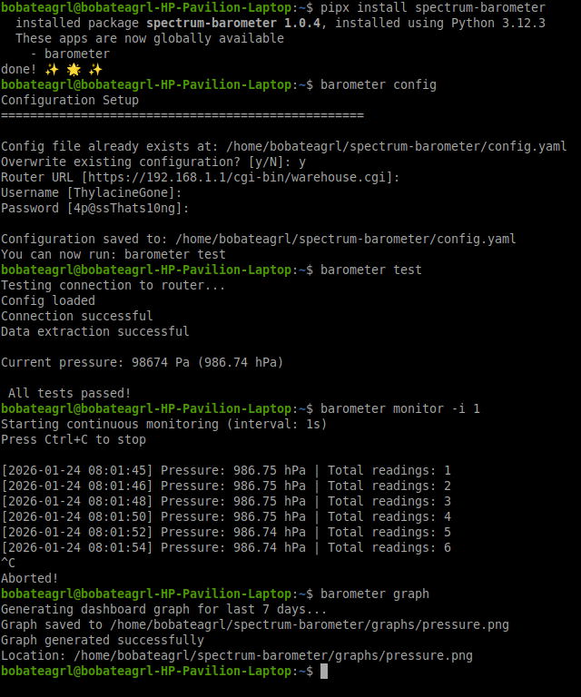

# Spectrum Router Barometer 

Monitor barometric pressure from Spectrum SAX2V1S routers.

## Installation

### Quick Install (Recommended)
```bash
pipx install git+https://github.com/BobaTeagrl/spectrum-barometer.git
```

Or with pip:
```bash
pip install git+https://github.com/BobaTeagrl/spectrum-barometer.git
```

## Updating

### For now you need to uninstall and reinstall i plan on making this cleaner soon but pipx only likes git so much
```bash
pipx uninstall spectrum-barometer
pipx install git+https://github.com/BobaTeagrl/spectrum-barometer.git
```

### First Time Setup
```bash
# Configure your router credentials
barometer config

# Test the connection
barometer test

```



All data is stored in `~/spectrum-barometer/` regardless of where you run the command.

## Usage
```bash
# Collect a single reading
barometer scrape

# Start continuous monitoring (every 5 minutes by default)
barometer monitor

# Generate a graph
barometer graph

# View statistics
barometer stats

# Archive old data
barometer archive

Append --help to any command to see extra options

```

## Finding Your Data

Everything is stored in `~/spectrum-barometer/`:

- **Graphs**: `~/spectrum-barometer/graphs/`
- **Data**: `~/spectrum-barometer/data/readings.csv`
- **Config**: `~/spectrum-barometer/config.yaml`
- **Logs**: `~/spectrum-barometer/logs/barometer.log`

You can run `barometer info` to see exact paths and current data.

# FAQ

### Why make this?

I find it funny. 

### Any other reason?

Spectrum is a very anti consumer company. this whole project started because i cant even access port forwarding, A VERY BASIC FEATURE and while trying to find a way around it i found the GitHub with the page and credentials used to find the barometer.

### How often can it update?

The barometer seems to update every second but that's super overkill lol but you can if you want to.

### Will you update this ever?

I may make a fully optional web GUI at some point for fun but its in a very usable state already. Plus cli tools are just kinda fun :3

### How hard is it to run?

When taking a reading it might take a few % of CPU and max ram use i personally have seen is 111MB (though not to say it can never get higher i cant know for sure im just one person) but when sitting idle its no CPU. i wanted this to be able to run on anything from a raspberry pi you already have set up running pi hole or something to someones single laptop that they are actively pushing while it runs in the background (because that's me)


# None of this would be possible without the work of MeisterLone on github

## He actually put in the work to reverse engineer this stupid router and i wouldnt have even realized routers had barometers without it lmao

## https://github.com/MeisterLone/Askey-RT5010W-D187-REV6


